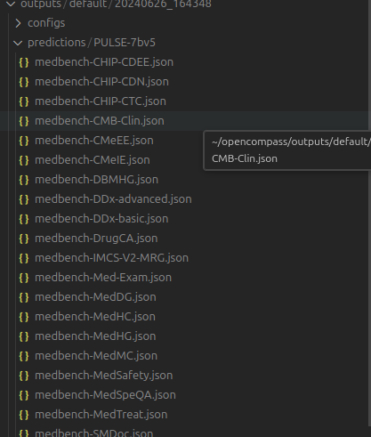
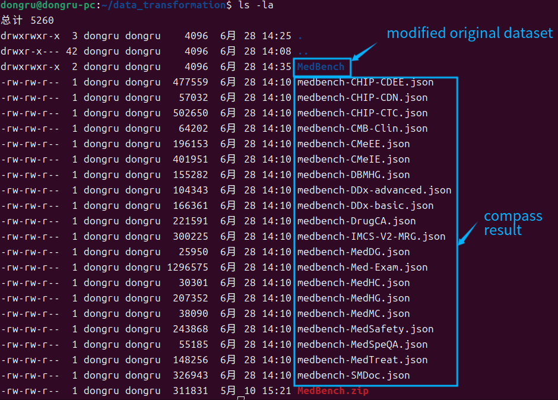
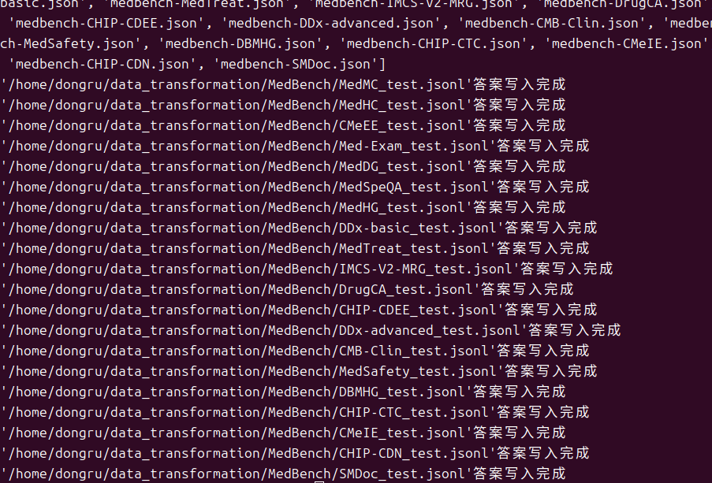
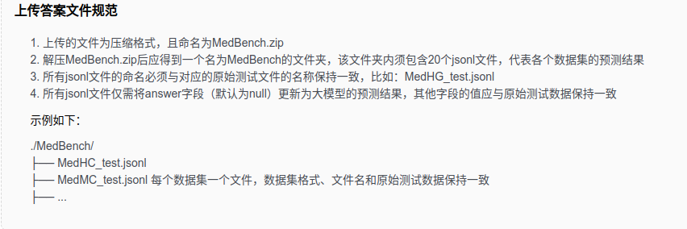
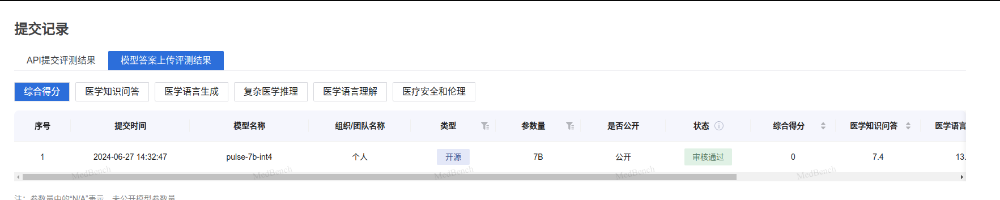

## <p align="center">📣 MedBench数据集的官网提交 </p>

## 一、在Opencompass内运行PULSE-7b模型对MedBench数据集的评估
- 运行完成推理
    ```shell
    conda activate opencompass
    cd opencompass
    python run.py --models hf_pulse_7b --datasets medbench_gen --debug
    ```
- 查看结果
<br> 找到目录'opencompass/outputs/default/2024xxx_xxx/predictions/PULSE-7bv5'，应有20个json文件。
<br>

结果示列(prediction内为答案)：
```
"0": {
    "origin_prompt": "任务：请回答单项选择题，要求只输出选项，不输出解释，答案放在<>里。\n任务示例: \n题目：\n泰能和含乳酸钠的溶液可以配伍吗？\nA.否\nB.是\n答：<A>\n\n题目：\n红霉素和维生素C可以配伍吗？\nA. 是\n B. 否\n答: ",
    "prediction": " <A>"
},
```

## 二、数据集和推理结果的整理
- 新建文件夹用于数据处理，并将20个json文件拷贝到此
    ```shell
    mkdir data_transformation
    cd data_transformation
    cp /home/dongru/opencompass/outputs/default/20240626_164348/predictions/PULSE-7bv5/* .
    ```

- 拷贝或者重新下载Medbench.zip原数据集到此目录(`data_transformation`)，并解压
    ```shell
    wget https://cdn-static.openxlab.org.cn/medical/MedBench.zip
    unzip MedBench.zip
    sudo rm -f MedBench.zip
    ```

- 整理原数据集
    ```shell
    cd MedBench
    find . -type f -name '*_test.jsonl' -exec mv {} ./ \;  ##提取测试集
    find . -mindepth 1 -type d -exec rm -r {} +  ##删除无用文件夹
    cd ..  ##回到data_transformation目录
    ```

    <br>

## 三、将答案写入原数据集以符合规范
- 新建python脚本`exchange.py`
    ```python
    import json
    import sys
    import os

    def get_json_files_in_current_directory():
        json_files = []
        current_directory = os.getcwd()
        json_files = [file for file in os.listdir(current_directory) if file.endswith('.json')]
        return json_files

    def read_json_file(file_path):
        with open(file_path, 'r', encoding='utf-8') as json_file:
            data = json.load(json_file)

        predictions = []
        for key, value in data.items():
            prediction = value.get('prediction', '').strip()
            predictions.append(prediction)
        return predictions

    def find_matching_files(json_file):
        new_filename = json_file.replace("medbench-", "").replace(".json", "_test.jsonl")
        current_directory = os.getcwd()
        new_filepath = os.path.join(current_directory,'MedBench',new_filename)
        return new_filepath

    def update_jsonl_file_with_predictions(jsonl_file, predictions):
        """
        更新 JSONL 文件中的 answer 字段。

        :param jsonl_file: JSONL 文件的路径。
        :param predictions: 预测结果列表。
        """
        updated_lines = []
        
        with open(jsonl_file, 'r', encoding='utf-8') as f:
            for i, line in enumerate(f):
                json_obj = json.loads(line.strip())
                if i < len(predictions):
                    json_obj['answer'] = predictions[i]
                updated_lines.append(json_obj)
        
        with open(jsonl_file, 'w', encoding='utf-8') as f:
            for json_obj in updated_lines:
                f.write(json.dumps(json_obj, ensure_ascii=False) + '\n')

    if __name__ == "__main__":
        json_files = get_json_files_in_current_directory()
        print(json_files)

        for json_file in json_files:
            data = []
            predictions = read_json_file(json_file)

            matching_files = find_matching_files(json_file)

            if os.path.exists(matching_files):
                update_jsonl_file_with_predictions(matching_files,predictions)
                print(f"'{matching_files}'答案写入完成")

            else:
                print(f"File '{matching_files}' not found.")
    ```

- 运行该脚本得到新的规范数据集
    ```shell
    python exchange.py
    ```

    <br>
    ><br>

- 重新打包并上传评测
    ```shell
    zip -r MedBench.zip MedBench/
    ```

    <br>提交压缩包等待打分
    <br>
    <br>
