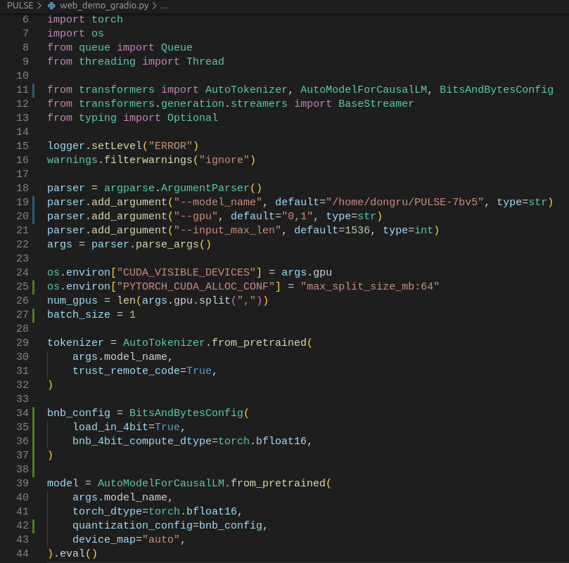

## <p align="center">📣 PULSE-7b模型和MedBench数据集部署过程</p>

## 一、官方网页Demo方式部署流程
- 拉取PULSE-7bv5模型
    ```bash
    hf-cli --model-id OpenMEDLab/PULSE-7bv5
    ```
- 拉取git仓库并创建conda环境
    ```bash
    git clone https://github.com/openmedlab/PULSE.git
    cd PULSE
    conda env create -f llm.yml
    conda activate llm
    ```
- 修改`web_demo_gradio.py`脚本
    <br>设置运行环境：
    ```python
    parser = argparse.ArgumentParser()
    ## 修改路径，default=""中替换为本机中的PULSE-7bv5模型路径
    parser.add_argument("--model_name", default="OpenMEDLab/PULSE-7bv5", type=str)  
    ## 设置GPU数量和编号，例如设置 default="0,1" 表示模型运行在双卡上，nvidia-smi命令查看显卡编号
    parser.add_argument("--gpu", default="0", type=str)
    parser.add_argument("--input_max_len", default=1536, type=int)
    args = parser.parse_args()
    ```
    <br>解决PyTorch显存碎片化问题：
    ```python
    ## 添加下行代码：
    os.environ["PYTORCH_CUDA_ALLOC_CONF"] = "max_split_size_mb:64"
    ```
    <br>设置batch_size大小：
    ```python
    ## 添加：
    batch_size = 1
    ```
- 执行`python web_demo_gradio.py`启动模型

## 二、小显存GPU的量化运行方法
1. huggingface官方指南中提供的量化方法
<br>[transformers中集成的量化库](https://huggingface.co/docs/transformers/quantization)
<br>[量化Transformers模型](https://huggingface.co/docs/transformers/main/zh/main_classes/quantization)
<br>[用 bitsandbytes、4 比特量化和 QLoRA 打造亲民的 LLM](https://huggingface.co/blog/zh/4bit-transformers-bitsandbytes)

2. 选择bitsandbytes加载PULSE-7bv5模型
    <br>确保库的完整安装：
    ```python
    conda activate llm
    pip install bitsandbytes>=0.39.0
    pip install --upgrade accelerate
    pip install --upgrade transformers
    ```
    <br>调整`web_demo_gradio.py`脚本，设置int4量化：
    ```python
    ## 启用BitsAndBytesConfig库
    from transformers import BitsAndBytesConfig
    ```
    ```python
    ## 配置int4量化参数
    bnb_config = BitsAndBytesConfig(
        load_in_4bit=True,
        bnb_4bit_compute_dtype=torch.bfloat16,
    )

    ## 模型加载
    model = AutoModelForCausalLM.from_pretrained(
        args.model_name, 
        torch_dtype=torch.bfloat16,
        quantization_config=bnb_config, ## 加载量化
        device_map="auto",
    ).eval()
    ```

3. 配置参考
    <br>
    
    >batch size=1时本地部署PULSE进行推理所需的显存大小。
    >|模型参数| 量化等级 | 加载模型 |
    >| -------- | -------- | -------- |
    >|7B        | FP16     | 14GB     |
    >|7B        | INT4     | 6GB      |

## 三、在OpenCompass中添加并运行推理的过程
### MedBench数据集的准备

### PULSE-7b添加方法

### 运行评估

